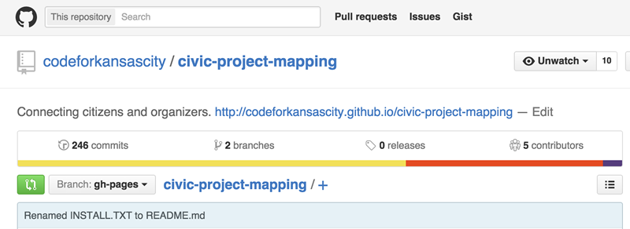

# sporkability :fork_and_knife: :couplekiss:

Best practices for making projects easy to fork. The most important thing you can do is simplify your projects as much as possible. This repository was created as part of an unconference at the Code for America 2015 Summit.

Have anything to add? Fork this repo and open a pull request.

This repo consists of three parts:

1. [Guidelines](#guidelines)
2. [Examples of projects that do a good job making themselves easy to fork](#examples)
3. [README Template](#readme-template)

# Guidelines


### Simplify your app as much as possible

- Reduce the number of dependencies
    - Do you really need mongo and memcached?
    - Do you even need a server?
    - Can your app just be static HTML + JS files hosted on GitHub Pages?
- Use simple, easy-to-deploy technology
    - Tools like Travis CI make deployment public. Anybody can look at the build history and figure out how things are built.
- *Deploy-This* buttons
    - [Deploy to Heroku button](https://devcenter.heroku.com/articles/heroku-button)


### Put yourself in your forker’s shoes

- Inline documentation, explain your thinking.
- User Context. Anything to better understand the intended users, uses, usage.


### Licenses and Copyright

- [ ] Choose a license and add it to your repo. [ChooseALicense.com](http://choosealicense.com) can help you choose a license. We recommend dedicating your work to the public domain. Why? The MIT, GPL, and other popular licenses don't answer the question of copyright.
- [ ] Don't put copyright 2015 John, Jane, Bob, etc. on every page (or even anywhere in the app). As somebody forking the repo, I don't want to put your name on every page. Will you be offended that I'm removing yourname?


### Admit your mistakes

- [ ] Are you unhappy with the architecture or the code of your app? Say so in the README or an issue (and explain why). People trying to fork your app may encounter some of these same problems and have solutions. Or they may just give up.


### Talk about your data

- [ ] What is the minimum amount of data do I need to get this project running?
- [ ] List where all the data the app uses, where it comes from, and how it is used.  
- [ ] Sample data, please.
- [ ] Tests and test data, if you used them.


### README.md

See the [README-template.md](README-template.md).

- [ ] Brief description of what the project does and why it exists. Explain why would someone else care.
- [ ] Include screenshots of the project so people can see the project in action without figuring out how to use it.
- [ ] Include a link to the project.
- [ ] Specify a maintainer.


### INSTALL.md

By default, include installation instructions in the README. Consider moving the instructions to a INSTALL.md if the instructions are very long and distract from the rest of the README.

- [ ] Use your languages package management tools. Avoid asking people to install them by hand. Be sure to use very specific version numbers (`6.6.6` is much better than just `6`).
    - Python: requirements.txt
    - JavaScript: package.json
    - Ruby: Gemfile
    - Go: :trollface: (Check in your dependencies, I guess)
- [ ] List dependencies that have to be manually installed. Link to useful guides on setting them up. Examples include Postgres, ...
- [ ] Test your installation and deployment instructions on a clean machine.
- [ ] CHANGELOG.md
    "It is a good idea to keep a changelog. http://keepachangelog.com (is a project on GitHub). "
    - See https://github.com/cfpb/qu and https://github.com/cfpb/hmda-explorer
    - Some Inspiration: http://keepachangelog.com/


### Be easy to contact

- Answer/use GitHub issues
- Add an email to the README, or add emails to your GitHub profile
- Specify a maintainer, and make sure the maintainer has an easy to find email
- If your brigade or project has a Slack channel, add a link to it.


### Code Style

- Format code consistently and follow a popular styleguide.
    - JavaScript    
        - [JS Standard Style](https://github.com/feross/standard)
        - [Airbnb JavaScript Style Guide](https://github.com/airbnb/javascript)
        - [ESLint](http://eslint.org/)
    - Python
        - [PEP8](https://www.python.org/dev/peps/pep-0008/)
        - [pyflakes](https://pypi.python.org/pypi/pyflakes)
    - Go
        - [gofmt](https://golang.org/cmd/gofmt/)


### Repo Metadata



- [ ] Fill out the `Description` on GitHub
- [ ] Fill out the `URL` on GitHub


### Configuration

- [ ] Keep your city specific configuration in one file
    - For example, if your app has a map with some initial coordinates, store those initial coordinates in a config file instead of making them difficult to find.
- [ ] Move other hard-coded values to a settings file.


# Examples

Some apps that have been easy to fork:

- [CutePetsBot](https://github.com/codeforamerica/CutePets) - Forked over 40 times. This project did a great job of explaining its benefit and being simple.
- [codeforamerica/bizfriendly-web](https://github.com/codeforamerica/bizfriendly-web/labels) - For its use of the [beginner friendly](https://github.com/codeforamerica/bizfriendly-web/issues?q=label%3A%22beginner+friendly%22+is%3Aclosed) [label](https://github.com/codeforamerica/bizfriendly-web/labels)


# README Template

```
# Project Name

TODO: Write a project description.

TODO: Link to a demo, project homepage, or whatever makes sense

TODO: Include a screenshot, wireframe or something visual other than a logo.

TODO: Sell your project.

TODO: Include a logo if your project has one.

TODO: Include any badges/shields if applicable. http://shields.io/

## Getting started

TODO: Explain how to use your project

## Installation

TODO: Describe the installation process

## Contributing

TODO: Explain how you would like people to contribute:

- Link to GitHub Issues if you use them
- List some things you would like to do with the project if you had more time

## History

TODO: Write history

## Credits

TODO: Write credits

## License

TODO: Write license
```
